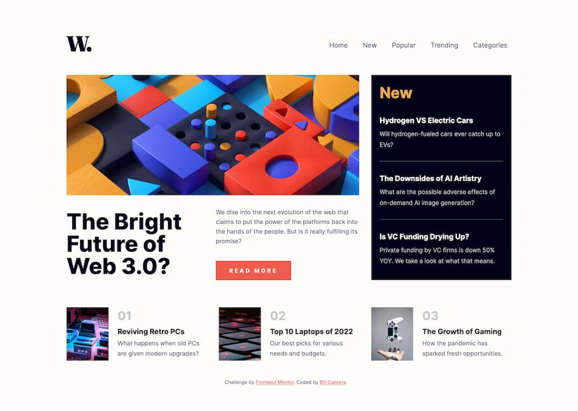

# Frontend Mentor - News homepage solution

This is a solution to the [News homepage challenge on Frontend Mentor](https://www.frontendmentor.io/challenges/news-homepage-H6SWTa1MFl). Frontend Mentor challenges help you improve your coding skills by building realistic projects. 

## Table of contents

- [Overview](#overview)
  - [The challenge](#the-challenge)
  - [Screenshot](#screenshot)
  - [Links](#links)
- [My process](#my-process)
  - [Built with](#built-with)
  - [Useful resources](#useful-resources)
- [Author](#author)

## Overview

### The challenge

Users should be able to:

- View the optimal layout for the interface depending on their device's screen size
- See hover and focus states for all interactive elements on the page

### Screenshot

### Links

- Solution URL: [GitHub repo](https://github.com/billccr/news-homepage)
- Live Site URL: [GitHub page](https://billccr.github.io/news-homepage/)

## My process

### Built with

- HTML5 Boilerplate
- normalize.css
- Semantic HTML5 markup
- Sass
- css grid layout
- vanilla JavaScript
- mobile-first workflow

### Useful resources

- [DevDocs](https://www.devdocs.io) - reference for a variety of development languages
- [MDN](https://developer.mozilla.org/en-US/) - web development resources

## Author

- Website - [Bill Cabrera](https://bdcabrera.com)
- Frontend Mentor - [@billccr](https://www.frontendmentor.io/profile/billccr)
- Mastodon - [@BDCabrera](https://masto.ai/@BDCabrera)

